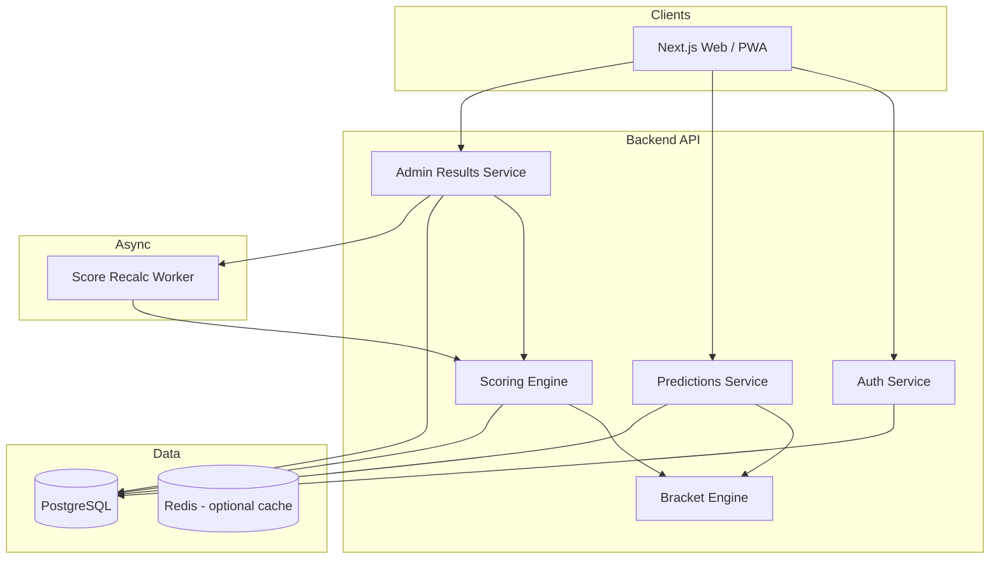
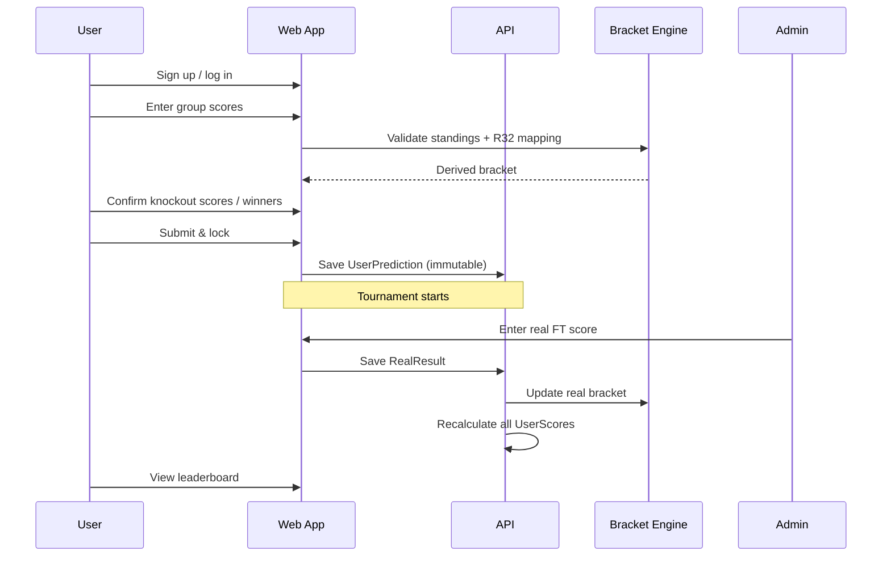

# World Cup 2026 Prediction App — Project Plan

## 1. Vision

A private (friends-and-family) web app where authenticated users submit **one locked bracket** before the tournament: group-stage results drive knockout matchups automatically, real results are entered as the Cup progresses, and a **live leaderboard** ranks everyone by prediction accuracy using a transparent, fair scoring model.

**Success criteria**

- Everyone can sign up, log in, and submit predictions before kickoff (11 June 2026).
- Group picks correctly determine who appears in Round of 32 and beyond (per FIFA bracket rules).
- Admins can update real scores with minimal friction during the tournament.
- Leaderboard updates within seconds of a result being saved.
- Rules and points are visible so disputes are rare.

---

## 2. 2026 Tournament Constraints (Product Must Match Reality)

| Phase | Detail |
|-------|--------|
| Teams | 48 nations in **12 groups** (A–L), 4 per group |
| Group stage | 72 matches, 11–27 June 2026; 3 points win, 1 draw, 0 loss |
| Qualifiers | Top 2 per group (24) + **8 best third-place** teams → Round of 32 |
| Knockout | R32 → R16 → QF → SF → Final (104 matches total) |
| Third-place tiebreakers | Points → goal difference → goals scored → fair play → etc. (FIFA order) |
| Bracket | Knockout pairings depend on **group letter + position** and which third-place slots fill which R32 fixtures |

**Implication for the app:** This is not “pick winners of 16 knockout games.” Users must predict **every group match** (or equivalent standings), **which eight third-placed teams advance**, and outcomes through the final. The engine must **derive knockout fixtures** from predictions using the official mapping (same as FIFA’s published bracket logic).

---

## 3. Core Features (Your Requirements → Spec)

### 3.1 Accounts & auth

- Email + password (or magic link) and optional **Google / Apple** OAuth for friends.
- One profile per person: display name, avatar, timezone.
- Roles: `user`, `admin` (score entry), optional `owner` (league settings).
- Session-based or JWT; refresh tokens for mobile-friendly PWA later.

### 3.2 Prediction entry & lock

**Single submission model (recommended)**

- One “My predictions” flow: group matches → auto-calculated standings → pick/order third-place qualifiers → knockout picks through champion.
- **Validation** before save: all 72 group scores (or W/D/L + GF/GA per team), third-place ranking across 12 groups, every knockout match filled.
- **Lock deadline:** tournament kickoff (or configurable, e.g. 1 hour before Match 1). After lock: read-only for users; admins can still enter real results.

**UX patterns**

- Step wizard: Groups A–L → Third-place wildcards → Bracket tree → Review & confirm.
- “Fill random” / “copy from template” only in dev; not in production.
- Show **derived bracket** side-by-side with a blank FIFA-style bracket PDF export (engagement).

**Alternative (not recommended for v1):** Weekly unlock windows — adds complexity and unfairness vs “everyone same information at start.”

### 3.3 Real results & live scoreboard

- Admin UI: enter final score per match (or FT + optional ET/Pens for knockouts).
- On save: recompute standings → advance teams in real bracket → **recalculate all users’ points**.
- Public **leaderboard**: rank, total points, breakdown (group / knockout / bonus), last updated timestamp.
- Optional: match-by-match “who got it right” after FT without revealing others’ picks until lock (configurable league rule).

### 3.4 Fair scoring system

Design goals: reward skill, avoid lottery-ticket dominance, keep knockout interesting without making group stage meaningless.

**Recommended hybrid model**

| Category | Rule | Points (example — tune in beta) |
|----------|------|----------------------------------|
| Group: exact score | Predicted score equals actual | **5** |
| Group: correct result | Right W/D/L but wrong score | **2** |
| Group: goal difference | Right margin, wrong absolute score (e.g. 2–0 vs 1–0) | **3** (optional middle tier) |
| Knockout: exact score (90 min) | Exact | **8** |
| Knockout: correct result (90 min) | W/D/L | **4** |
| Knockout: winner only | Right team advances (incl. ET/Pens path) | **3** |
| Advancement bonus | Correct team in correct round (e.g. predicted Brazil in SF, they reach SF) | **+2** per round (cap) |
| Champion / runner-up | Correct winner | **+15**; correct finalist loser | **+8** |
| Third-place wildcard | Each correct team in the 8 | **+3** each |
| Late submission | — | **0** (hard lock) |

**Fairness rules**

- Publish full rubric before lock; no mid-tournament rule changes.
- Same max points for every user (104 matches + bonuses → fixed ceiling).
- Optional **normalization**: show “% of max possible so far” so late joiners aren’t compared on raw totals (only if you allow late join — otherwise disallow).
- **Tiebreaker** on leaderboard: (1) most exact scores, (2) champion pick correct, (3) head-to-head mini-league optional.

**What to avoid**

- Pure “winner only” for every match (reduces skill).
- Huge random bonus pools.
- Letting users edit picks after any match starts.

### 3.5 Engagement & usability (extra features)

| Feature | Why |
|---------|-----|
| Private **leagues** (invite code) | Multiple friend groups in one deployment |
| **Mini-leagues** inside global pool | Compete with subset, same underlying picks |
| Match calendar + timezone | 3 host countries; show local kickoff |
| Push / email digests | “3 matches today; you’re 4th in league” |
| **H2H compare** with one friend | See divergent picks on next fixture |
| **What-if** after lock | Only on *real* results, not changing picks — “if Mexico wins, you gain 12 pts” |
| Achievement badges | First exact score, perfect group, called the upset |
| Comments or reactions per match | Light social (moderation for spam) |
| Export picks PDF / share card | Social sharing without exposing full bracket |
| PWA / mobile-first UI | Most users will check during games on phone |
| Dark mode + accessibility | WCAG contrast for tables |

---

## 4. System Architecture (Recommended)



**Stack suggestion (pragmatic for a friends app)**

| Layer | Choice | Rationale |
|-------|--------|-----------|
| Frontend | **Next.js 15** (App Router) + TypeScript | SSR for leaderboard SEO; API routes optional |
| UI | Tailwind + shadcn/ui | Fast, consistent forms/tables |
| API | **tRPC** or REST in Next.js | Type-safe end-to-end |
| DB | **PostgreSQL** + Prisma | Relational fit: matches, users, predictions |
| Auth | **Auth.js (NextAuth)** or Clerk | OAuth + credentials quickly |
| Hosting | Vercel + Neon/Supabase | Low ops for small group |
| Admin | Protected `/admin` routes | Role-gated score entry |

**Bracket engine (critical path)**

- Pure TypeScript module, heavily unit-tested:
  1. From group match results → table per group (points, GD, GF, etc.).
  2. Rank 12 third-place teams → select top 8.
  3. Apply FIFA fixture mapping → R32 pairings → single-elimination tree through final.
- Same engine runs on **user predictions** and **official results**.

**Data sources for fixtures**

- v1: Seed DB from FIFA schedule JSON (manual import or script before June).
- v2: Periodic sync from a sports API (license/cost) — optional.

---

## 5. Data Model (High Level)

```
User
League (optional)
LeagueMember
Tournament (2026)
Team
Group
Match (stage, group_id?, home_team, away_team, kickoff, slot codes for bracket)
UserPrediction (user_id, tournament_id, locked_at, status)
MatchPrediction (prediction_id, match_id, home_score, away_score)
GroupStandingSnapshot (optional cache)
ThirdPlaceSelection (ordered list of team_ids for wildcard)
KnockoutPrediction (derived or stored match_id → winner/score)
RealResult (match_id, home_score, away_score, went_to_pens, pen_home, pen_away)
UserScore (user_id, tournament_id, breakdown JSON, total, updated_at)
```

Store **canonical predictions as per-match scores**; derive knockout path in code to avoid inconsistent state.

---

## 6. Key User Flows



---

## 7. Implementation Phases

### Phase 0 — Foundation (1–2 weeks of focused dev)

- Repo setup, CI, env templates
- DB schema: teams, groups, 104 matches (seed from schedule)
- Auth + user profile
- Admin role seed

### Phase 1 — Bracket engine (highest risk)

- Implement group tiebreakers (mirror FIFA order)
- Implement third-place ranking across groups
- Implement R32–Final mapping from official bracket doc
- **100+ unit tests** with known scenarios (including tied groups)

### Phase 2 — Predictions UI

- Group entry grid (by group / by day)
- Live derived bracket preview
- Knockout entry + review page
- Lock + immutability

### Phase 3 — Scoring & leaderboard

- Scoring module from rubric
- Batch recalc on result save
- Leaderboard + personal stats page

### Phase 4 — Admin & polish

- Admin match list (filter: today, needs result)
- Leagues / invite codes
- Notifications, PWA manifest
- Docs page: “How scoring works”

### Phase 5 — Post-tournament

- Archive season, export results, reset for 2030 template

---

## 8. Non-Functional Requirements

| Area | Target |
|------|--------|
| Security | HTTPS, hashed passwords, CSRF, rate limit login |
| Privacy | Predictions hidden until lock; GDPR-friendly delete account |
| Performance | Leaderboard recalc < 2s for 50 users |
| Availability | 99% during June–July (friends will rage if down at FT) |
| Backup | Daily DB backup during tournament |

---

## 9. Risks & Mitigations

| Risk | Mitigation |
|------|------------|
| FIFA bracket mapping errors | Test against published examples; link to FIFA article in code comments |
| Third-place scenario explosion | Don’t ask users to pick “which slot” manually — engine assigns from rankings |
| Overtime / penalties | Store 90-min score for group; knockout “winner advances” uses pens fields |
| Disputed scoring | Frozen rubric + public FAQ |
| Scope creep | Ship v1 without chat, API sync, or multi-tournament |

---

## 10. Open Decisions (Need Your Input Before Build)

1. **Single global pool** vs multiple private leagues on day one?
2. **Exact score only** vs W/D/L quick entry for group stage?
3. **Allow partial save** before lock or require complete bracket?
4. **Reveal others’ picks** before lock (social) or after kickoff only?
5. **Who is admin** — you only, or delegated friends?
6. **Hosting budget** — free tier OK or paid for reliability?

---

## 11. Suggested Repository Layout

```
/apps/web          # Next.js frontend + API
/packages/bracket  # Bracket + standings engine (testable in isolation)
/packages/scoring  # Points calculation
/prisma            # Schema + migrations
/scripts           # Seed 2026 fixtures from JSON
/docs              # This plan + FIFA mapping notes
```

---

## 12. Next Step

Once open decisions in §10 are answered, Phase 0 + Phase 1 (schema seed + bracket engine tests) should be the first code merged. Everything else depends on that engine being correct.
